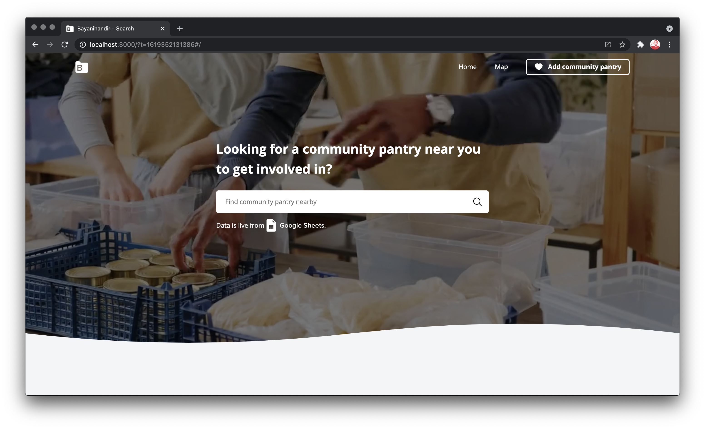

[](https://chcepe.github.io/bayanihan-dir/)

## 🇵🇭 bayanihan-dir

The community pantry craze that has spread nationwide undoubtedly showcases the Filipino “bayanihan” trait at its finest. From condiments to fresh food items to medical supplies, the pantries have it all.

Bayanihandir is a platform to find community pantries in different places around the Philippines.

## Setup

1.  Clone the repository.

```
git clone https://github.com/chcepe/bayanihan-dir.git
```

2.  Install dependencies `npm install` or `yarn install`
3.  Start the app `npm run dev` or `yarn dev`
4.  Browse [localhost:3000](http://localhost:3000/) in your browser of choice

## Deploy on Vercel

The easiest way to deploy a Next.js app is to use the [Vercel Platform](https://vercel.com/import?utm_medium=default-template&filter=next.js&utm_source=create-next-app&utm_campaign=create-next-app-readme) from the creators of Next.js.

Check out [Next.js deployment documentation](https://nextjs.org/docs/deployment) for more details

## License

[bayanihan-dir](https://github.com/chcepe/bayanihan-dir) is distributed under the MIT License, available in this repository.

All contributions are assumed to be also licensed under the same.
